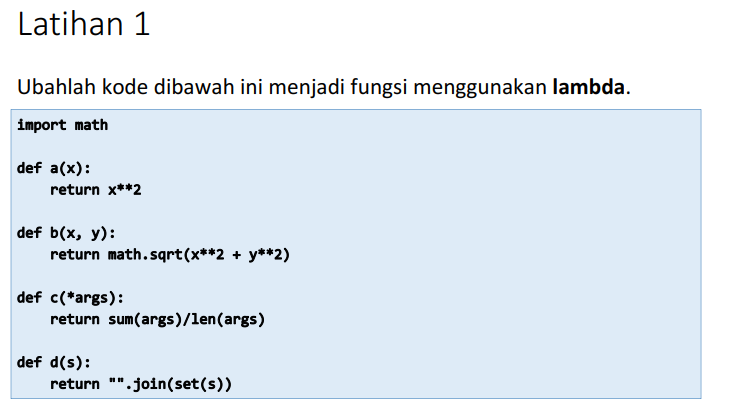
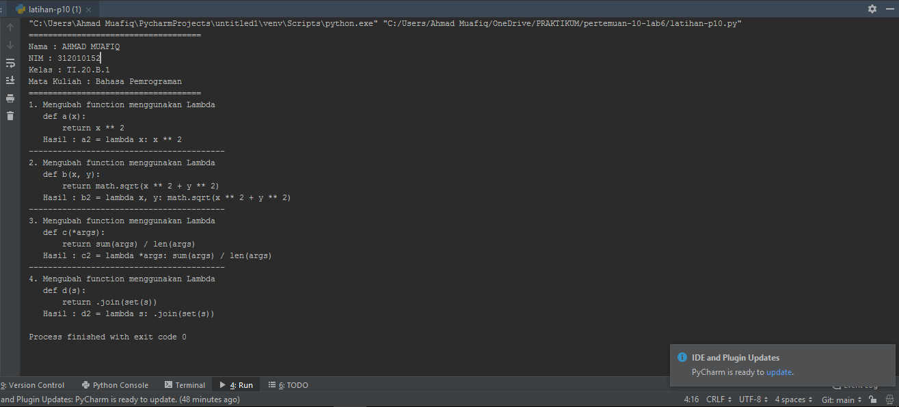

# pertemuan-10-lab6
Repository ini dibuat untuk memenuhi Tugas Bahasa Pemrograman - Pertemuan 10 - lab6

Pada mata kuliah Bahasa Pemrograman Pertemuan 10, saya diberi materi oleh dosen yaitu. Fungsi, Module dan Package.<br>

## Latihan

Pada pembahasan kali ini saya diberikan tugas oleh dosen untuk mengerjakan sebuah program sederhana dalam sebuah Tugas Latihan.

* Dosen memberikan tugas seperti berikut :<br>
 <br>

* Setelah saya membaca dan memahami materi yang diberikan oleh Dosen, dan mencari referensi dari Internet, entah itu dari Forum Programmer ataupun Modul-modul yang dishare oleh seseorang<br>

* Seperti berikut source code yang telah saya kerjakan untuk Tugas Latihan :<br>

``` python
import math

print("====================================")
print("Nama : AHMAD MUAFIQ")
print("NIM : 312010152")
print("Kelas : TI.20.B.1")
print("Mata Kuliah : Bahasa Pemrograman")
print("====================================")


def a(x):
    return x ** 2


a2 = lambda x: x ** 2

print("1. Mengubah function menggunakan Lambda \n   def a(x): \n \t   return x ** 2")
print("   Hasil : a2 = lambda x: x ** 2")


def b(x, y):
    return math.sqrt(x ** 2 + y ** 2)


b2 = lambda x, y: math.sqrt(x ** 2 + y ** 2)

print("-----------------------------------------")
print("2. Mengubah function menggunakan Lambda \n   def b(x, y): \n \t   return math.sqrt(x ** 2 + y ** 2)")
print("   Hasil : b2 = lambda x, y: math.sqrt(x ** 2 + y ** 2)")


def c(*args):
    return sum(args) / len(args)


c2 = lambda *args: sum(args) / len(args)

print("-----------------------------------------")
print("3. Mengubah function menggunakan Lambda \n   def c(*args): \n \t   return sum(args) / len(args)")
print("   Hasil : c2 = lambda *args: sum(args) / len(args)")


def d(s):
    return "".join(set(s))


d2 = lambda s: "".join(set(s))

print("-----------------------------------------")
print("4. Mengubah function menggunakan Lambda \n   def d(s): \n \t   return "".join(set(s))")
print("   Hasil : d2 = lambda s: "".join(set(s))")
```

* Dari hasil source code diatas sebagai berikut :<br>


* Dalam Tugas Latihan diatas saya menggunakan bahasa Lambda

<hr>
